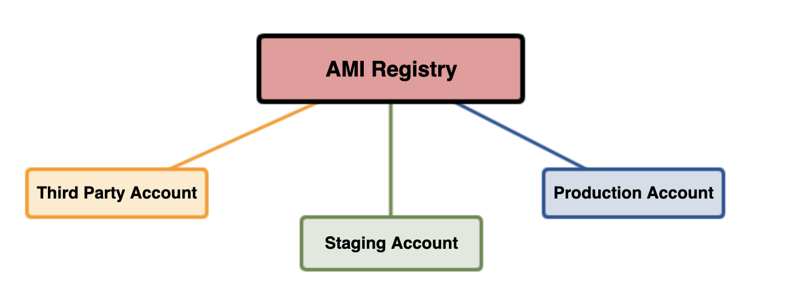
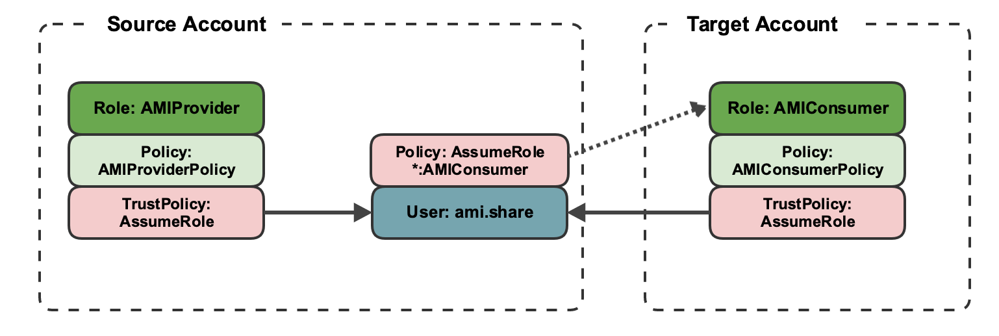

## AWS AMI Share


* [Configure IAM permission on "source" (owner of AMIs) account](#iam-permissions-on-source-account)
* [Configure IAM permission on target account](#iam-permissions-on-target-account)
* [Encrypted AMIs](#encrypted-amis)
* [Utility usage](#usage)
* [Configuring a manifest](#configure-manifest)

## Overview

Utility for sharing AMIs from a AWS source account to one or more target account(s). This utility works best in a ecosystem of accounts where the source account acts like a central registry of AMIs.


During a run, the following actions happen:
* Share AMIs to target account(s)
* Give target account access to EBS snapshots (for EBS-backed AMIs)
* Copy AMI tags to AMI in target account
* Mark shared AMI with marker tags. Marker tags include:
    * Static user-supplied tags in config property `post-share-tags`: e.g. `"Shared=true, UnDeletable=true"`
    * Meta tags added by this utility:`"SharedWith-<TARGET_ACCOUNT_ALIAS>=true"` after successfully sharing with a target account in the config.

**Cross Account Access**:
The user that is running this CLI MUST have permissions to assume the roles specified in the target accounts. The specific role to assume is `AMIShareConsumer` role. 

### IAM Permissions

The `aws-ami-share` tool requires IAM permission on both source and target account. The setup is described below.

#### IAM Permissions on source account

The permissions required on the source account are described in the policy below.

```yaml
Policy: AMIShareSourcePolicy
    {
      "Version": "2012-10-17",
      "Statement": [
        {
          "Sid": "TagResources",
          "Effect": "Allow",
          "Action": [
            "ec2:CreateTags"
          ],
          "Resource": [
            "arn:aws:ec2:*::image/*",
            "arn:aws:ec2:*::snapshot/*"
          ]
        },
        {
          "Sid": "GetAccountAlias",
          "Effect": "Allow",
          "Action": [
            "iam:ListAccountAliases"
          ],
          "Resource": "*"
        },
        {
          "Sid": "ShareImageOperations",
          "Effect": "Allow",
          "Action": [
            "ec2:DescribeImages",
            "ec2:DescribeTags",
            "ec2:ModifyImageAttribute",
            "ec2:ModifySnapshotAttribute"
          ],
          "Resource": "*"
        }
      ]
    }
```

The above policy should be attached to a role created in the source account. In addition the IAM principal that will be running this CLI should be given permissions to assume the role with this policy.

```yaml
Role: AMIShareProvider
AssumeRolePolicy:
    {
      "Version": "2012-10-17",
      "Statement": [
        {
          "Effect": "Allow",
          "Principal": {
            "AWS": "arn:aws:iam::<SOURCE_ACCOUNT>:root"
          },
          "Action": "sts:AssumeRole",
          "Condition": {}
        }
      ]
    }
Policies:
- AMIShareSourcePolicy (see policy above)

```

#### IAM Permissions on target account

The permissions required on the target account(s) for sharing an AMI are described in the policy below.

```yaml
Policy: AMIShareConsumerPolicy
    {
      "Version": "2012-10-17",
      "Statement": [
        {
          "Sid": "TagResources",
          "Effect": "Allow",
          "Action": [
            "ec2:CreateTags"
          ],
          "Resource": [
            "arn:aws:ec2:*::image/*",
            "arn:aws:ec2:*::snapshot/*"
          ]
        },
        {
          "Sid": "GetAccountAlias",
          "Effect": "Allow",
          "Action": [
            "iam:ListAccountAliases"
          ],
          "Resource": "*"
        }
      ]
    }
```

The above policy should be attached to a role created in the target account(s). In addition IAM principal that will be running this CLI should be given permissions to assume the role with this policy.

```yaml
Role: AMIShareConsumer
AssumeRolePolicy:
    {
      "Version": "2012-10-17",
      "Statement": [
        {
          "Effect": "Allow",
          "Principal": {
            "AWS": "arn:aws:iam::<SOURCE_ACCOUNT>:root"
          },
          "Action": "sts:AssumeRole",
          "Condition": {}
        }
      ]
    }
Policies:
- AMIShareConsumerPolicy (see policy above)
```

The setup should look like the diagram below:



### Encrypted AMIs

This tool does not interact with/manage KMS key sharing. For encrypted AMIs, the target account(s) must have access to the encryption KMS used to encrypt the AMI. THIS UTILITY DOES NOT SETTING UP KMS KEY ACCESS. 

Some useful AWS resources related to encrypted AMIs/instances:
* [Sharing AMI KMS keys](https://aws.amazon.com/blogs/security/share-custom-encryption-keys-more-securely-between-accounts-by-using-aws-key-management-service/)
* [Launching Encrytped Instance from Unencrypted AMIs](https://aws.amazon.com/blogs/security/how-to-quickly-launch-encrypted-ebs-backed-ec2-instances-from-unencrypted-amis/)

## Usage

```bash
AWS AMI Share is a utility for sharing AMIs across accounts.
Version=v2.6.15.g69a00990.dirty, Build=69a00990f45b3f9ea861484064e91c9b496ffcb2, Date=Sat May 18 23:07:38 EDT 2019

Usage:
 ami-share [flags]

Examples:
AWS AMI Share is a utility for sharing AMIs across accounts.
Version=v2.6.15.g69a00990.dirty, Build=69a00990f45b3f9ea861484064e91c9b496ffcb2, Date=Sat May 18 23:13:16 EDT 2019

Usage:
  ami-share [flags]

Examples:
AWS_SDK_LOAD_CONFIG=true AWS_PROFILE=staging-ami ./ami-share -v -c example.yaml -p plan.yaml

Flags:
  -c, --config string     (required) Path to the config file.
  -h, --help              help for ami-share
      --no-dry-run        If specified, it shares AMIs. Otherwise it just list target candidates in plan file.
  -p, --plan string       (required) Path to output file for plan.
      --share-snapshots   (optional) Whether to share snapshots attached to AMIs.
  -v, --verbose           Enables debug output.
      --version           version for ami-share
```

This utility uses standard AWS credentials. Since it uses the GO SDK, you should set the environment variable `AWS_SDK_LOAD_CONFIG=true` which the AWS GO SDK requires if using a custom credentials file.
This [article](https://docs.aws.amazon.com/sdk-for-php/v3/developer-guide/guide_credentials_profiles.html) contains more information about AWS credentials file.

## Configure manifest
The configuration has the following format:

```yaml
source-account:
  id: '************'
  alias: registry-account
  assume-role: "AMIShareProvider"
  post-share-tags:
    Shared: 1

target-accounts:
  - id: '************'
    alias: integration-account
    assume-role: "AMIShareConsumer"
    regions:
      - us-east-1
    amis:
      web:
        filters:
          - property: tag:Name
            value: WebApp
```

The manifest has these fields:

| Field  | Explanation |
| ------------- | ------------- |
| **id**  | Account ID in AWS |
| **alias**  | Account alias must match the IAM account alias in AWS - will also be used in the meta tag `"ShareWith-"`. |
| **post-share-tags**  | (Optional) Only applicable to source account. The set of tags to add after sharing an AMI to mark it as such. |
| **regions**  | Set of regions to share AMIs for this account. Can be overridden per AMI entry in `amis` property. |
| **amis**  | A map of AMI alias to filters to find this AMI and (optional) regions to share it in (override account regions). |

### Filters
Filters section in config yaml should provide "property" and "value" as shown in the example above. If value contains white spaces, it should be surrounded by double quotes. The possible property are as following.

| Property | Description | Example of value |
| -------- | ----------- | ------- |
| tag:[tag name] | Any tag property such as `tag:Name` | smp |
| AMIName | AMI Name | "smp 1557419569" |
| ID | AMI ID | ami-07f067a1643a549f3 |

Multiple property/value pair can be provided and they will be "AND"-joined.


### Variables in Config

Variables from the environment can be injected into the config using the syntax `{{ .VarName }}`. These variable are read from the environment.

For example, if the config has contents and environment variable `GitHash=934JDOJF`:
```yaml
    amis:
      proxy:
        filters:
          - property: tag:GitHash
            value: {{ .GitHash }}
```

This will be resolved to:
```yaml
    amis:
      proxy:
        filters:
          - property: tag:GitHash
            value: 934JDOJF
```

## Plan

This utility can be run in a plan mode. This is similar to a dry run mode, the output will be written to a YAML file. The output file format is similar to the config - it gives a summary of processed AMIs. 

```yaml
source-account:
  id: '************'
  alias: registry-account
  assume-role: arn:aws:iam::************:role/AMIShareProvider
  amis:
    all:
      us-east-1:
      - ID=ami-0042e12a118e0e666, Name=centos-base 1557402212, Date=2019-05-09T11:47:23.000Z
      - ID=ami-01627485c1afecab3, Name=salt-master 1556800156, Date=2019-05-02T12:32:42.000Z
      - ID=ami-01ae7ef67904f53aa, Name=web 1557163383, Date=2019-05-06T17:26:04.000Z
      - ID=ami-01cdfe13b893c918e, Name=web 1555343610, Date=2019-04-15T15:56:13.000Z
      - ID=ami-026c267e0f55acb47, Name=centos-base 1556197455, Date=2019-04-25T13:08:15.000Z
      - ID=ami-033639f6dabc7fe3d, Name=web 1557173915, Date=2019-05-06T20:21:36.000Z
      - ID=ami-03d7d5c301b7c4214, Name=salt-master 1557922320, Date=2019-05-15T12:15:08.000Z
      - ID=ami-0624083c2a7a25b0f, Name=salt-master 1557414503, Date=2019-05-09T15:12:18.000Z
      - ID=ami-0652b6884ced0d9aa, Name=web 1557922631, Date=2019-05-15T12:19:11.000Z
      - ID=ami-0655afaf61c633388, Name=web 1556198786, Date=2019-04-25T13:30:59.000Z
      - ID=ami-06e97c608a2bc870e, Name=centos-base 1555342382, Date=2019-04-15T15:41:34.000Z      
      - ID=ami-074de3342df5942f8, Name=salt-master 1556198013, Date=2019-04-25T13:18:38.000Z
      - ID=ami-07d09200b9a34ed9d, Name=salt-master 1555343346, Date=2019-04-15T15:51:56.000Z      
      - ID=ami-0884bc88383252b5a, Name=web 1557402995, Date=2019-05-09T11:59:04.000Z
      - ID=ami-08d081224234e970c, Name=centos-base 1557921767, Date=2019-05-15T12:07:04.000Z
      - ID=ami-0bb2e9c091228a8ea, Name=centos-base 1556799610, Date=2019-05-02T12:24:25.000Z      
      - ID=ami-0f510098b2f5c1c4c, Name=web 1556800454, Date=2019-05-02T12:36:55.000Z
target-accounts:
- id: '************'
  alias: integration-account
  assume-role: arn:aws:iam::************:role/AMIShareConsumer
  amis:
    proxy:
      us-east-1:
      - ID=ami-0652b6884ced0d9aa, Name=web 1557922631, Date=2019-05-15T12:19:11.000Z
```

## Sample Run

#### Dry Run

```
INFO[0000] Validating config                             context=share-command operation=validation
INFO[0000] Initializing                                  context=share-command operation=validation
DEBU[0000] Creating master session with: ************ in global as [arn:aws:iam::************:role/AMIShareProvider]  context=aws-session-factory operation=session
INFO[0000] Validating accounts                           context=share-command operation=validation
INFO[0000] Validating source account                     context=aws-share-ami operation=share
DEBU[0000] Generating session: ************ in us-east-1 as [arn:aws:iam::************:role/AMIShareProvider]  context=aws-session-factory operation=session
DEBU[0000] Generating session: ************ in global as [arn:aws:iam::************:role/AMIShareProvider]  context=aws-session-factory operation=session
INFO[0000] Validating account: ************              context=aws-share-ami operation=share
DEBU[0000] Generating session: ************ in us-east-1 as [arn:aws:iam::************:role/AMIShareConsumer]  context=aws-session-factory operation=session
DEBU[0000] Generating session: ************ in global as [arn:aws:iam::************:role/AMIShareConsumer]  context=aws-session-factory operation=session
INFO[0000] Generating plan for sharing AMIs              context=aws-share-ami operation=share
DEBU[0001] AMIs in source account: map[us-east-1:[ami-0042e12a118e0e666 ami-01627485c1afecab3 ami-01ae7ef67904f53aa ami-01cdfe13b893c918e ami-026c267e0f55acb47 ami-033639f6dabc7fe3d ami-03d7d5c301b7c4214 ami-0624083c2a7a25b0f ami-0652b6884ced0d9aa ami-0655afaf61c633388 ami-06e97c608a2bc870e ami-0735224a86fcbf1b5 ami-074de3342df5942f8 ami-07d09200b9a34ed9d ami-07f067a1643a549f3 ami-0884bc88383252b5a ami-08d081224234e970c ami-0bb2e9c091228a8ea ami-0dd6d0bdabb5734f4 ami-0f510098b2f5c1c4c]]  context=aws-share-ami operation=share
INFO[0001] Processing proxy AMIs                         context=aws-share-ami operation=share
INFO[0001] Found 1 proxy AMIs in [us-east-1]             context=aws-share-ami operation=share
DEBU[0001] Filtered proxy AMIs in [us-east-1] => [ami-0652b6884ced0d9aa]  context=aws-share-ami operation=share
INFO[0001] Account: map[proxy:map[us-east-1:[ami-0652b6884ced0d9aa]]]  context=aws-share-ami operation=share
DEBU[0001] Plan for sharing: &{{************ saas-staging arn:aws:iam::************:role/AMIShareProvider map[all:map[us-east-1:[ami-0042e12a118e0e666 ami-01627485c1afecab3 ami-01ae7ef67904f53aa ami-01cdfe13b893c918e ami-026c267e0f55acb47 ami-033639f6dabc7fe3d ami-03d7d5c301b7c4214 ami-0624083c2a7a25b0f ami-0652b6884ced0d9aa ami-0655afaf61c633388 ami-06e97c608a2bc870e ami-0735224a86fcbf1b5 ami-074de3342df5942f8 ami-07d09200b9a34ed9d ami-07f067a1643a549f3 ami-0884bc88383252b5a ami-08d081224234e970c ami-0bb2e9c091228a8ea ami-0dd6d0bdabb5734f4 ami-0f510098b2f5c1c4c]]]} [{************ saas-integration arn:aws:iam::************:role/AMIShareConsumer map[proxy:map[us-east-1:[ami-0652b6884ced0d9aa]]]}]}  context=aws-share-ami operation=share
INFO[0001] Wrote plan to: test.yaml                      context=aws-share-ami operation=share
INFO[0001] Would share AMIs in plan: test.yaml           context=aws-share-ami operation=share
```

#### Real Run
```
INFO[0000] Validating config                             context=share-command operation=validation
INFO[0000] Initializing                                  context=share-command operation=validation
DEBU[0000] Creating master session with: ************ in global as [arn:aws:iam::************:role/AMIShareProvider]  context=aws-session-factory operation=session
INFO[0000] Validating accounts                           context=share-command operation=validation
INFO[0000] Validating source account                     context=aws-share-ami operation=share
DEBU[0000] Generating session: ************ in us-east-1 as [arn:aws:iam::************:role/AMIShareProvider]  context=aws-session-factory operation=session
DEBU[0000] Generating session: ************ in global as [arn:aws:iam::************:role/AMIShareProvider]  context=aws-session-factory operation=session
INFO[0000] Validating account: ************              context=aws-share-ami operation=share
DEBU[0000] Generating session: ************ in us-east-1 as [arn:aws:iam::************:role/AMIShareConsumer]  context=aws-session-factory operation=session
DEBU[0000] Generating session: ************ in global as [arn:aws:iam::************:role/AMIShareConsumer]  context=aws-session-factory operation=session
INFO[0000] Generating plan for sharing AMIs              context=aws-share-ami operation=share
DEBU[0001] AMIs in source account: map[us-east-1:[ami-0042e12a118e0e666 ami-01627485c1afecab3 ami-01ae7ef67904f53aa ami-01cdfe13b893c918e ami-026c267e0f55acb47 ami-033639f6dabc7fe3d ami-03d7d5c301b7c4214 ami-0624083c2a7a25b0f ami-0652b6884ced0d9aa ami-0655afaf61c633388 ami-06e97c608a2bc870e ami-0735224a86fcbf1b5 ami-074de3342df5942f8 ami-07d09200b9a34ed9d ami-07f067a1643a549f3 ami-0884bc88383252b5a ami-08d081224234e970c ami-0bb2e9c091228a8ea ami-0dd6d0bdabb5734f4 ami-0f510098b2f5c1c4c]]  context=aws-share-ami operation=share
INFO[0001] Processing proxy AMIs                         context=aws-share-ami operation=share
INFO[0001] Found 1 proxy AMIs in [us-east-1]             context=aws-share-ami operation=share
DEBU[0001] Filtered proxy AMIs in [us-east-1] => [ami-0652b6884ced0d9aa]  context=aws-share-ami operation=share
INFO[0001] Account: map[proxy:map[us-east-1:[ami-0652b6884ced0d9aa]]]  context=aws-share-ami operation=share
DEBU[0001] Plan for sharing: &{{************ saas-staging arn:aws:iam::************:role/AMIShareProvider map[all:map[us-east-1:[ami-0042e12a118e0e666 ami-01627485c1afecab3 ami-01ae7ef67904f53aa ami-01cdfe13b893c918e ami-026c267e0f55acb47 ami-033639f6dabc7fe3d ami-03d7d5c301b7c4214 ami-0624083c2a7a25b0f ami-0652b6884ced0d9aa ami-0655afaf61c633388 ami-06e97c608a2bc870e ami-0735224a86fcbf1b5 ami-074de3342df5942f8 ami-07d09200b9a34ed9d ami-07f067a1643a549f3 ami-0884bc88383252b5a ami-08d081224234e970c ami-0bb2e9c091228a8ea ami-0dd6d0bdabb5734f4 ami-0f510098b2f5c1c4c]]]} [{************ saas-integration arn:aws:iam::************:role/AMIShareConsumer map[proxy:map[us-east-1:[ami-0652b6884ced0d9aa]]]}]}  context=aws-share-ami operation=share
INFO[0001] Wrote plan to: test.yaml                      context=aws-share-ami operation=share
INFO[0001] Running plan for sharing AMIs                 context=aws-share-ami operation=share
INFO[0001] Sharing AMI proxy[ami-0652b6884ced0d9aa] with account [************] in region [us-east-1]  context=aws-share-ami operation=share```
```
